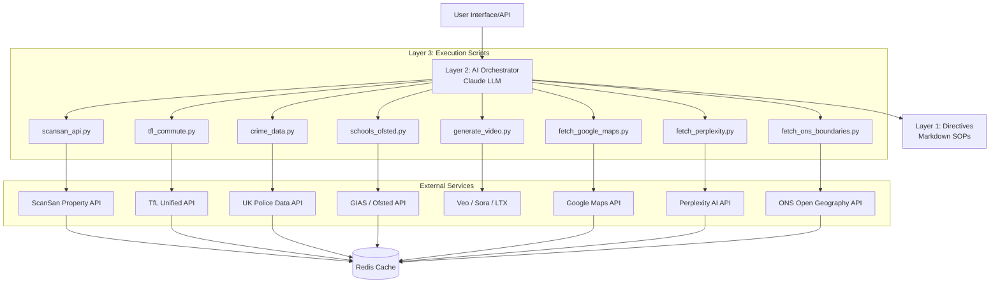
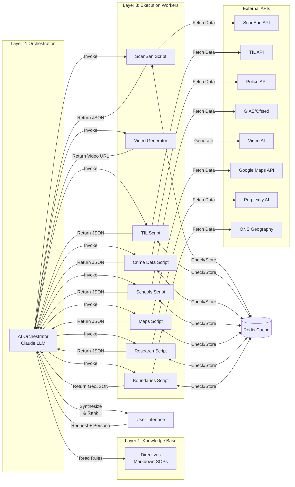
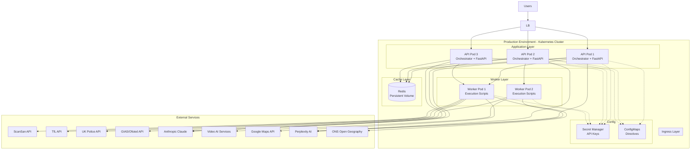

# System Architecture: Veo Housing Platform

## Overview

The Veo Housing Platform is an AI-powered property recommendation engine designed to provide personalised, data-driven area recommendations for London property seekers. The system employs a unique 3-layer AI orchestration architecture that separates directive-based instructions (Layer 1) from intelligent routing and decision-making (Layer 2), and deterministic script execution (Layer 3). This architectural pattern ensures reliability, maintainability, and self-improvement capabilities whilst leveraging the probabilistic nature of large language models only where appropriate.

The primary goal of the system is to automate the complex process of location research, providing users with data-driven insights tailored to their specific lifestyle personas (e.g., students, parents, or investors).

## Key Requirements

### Functional
- **Persona-Driven Recommendations**: Tailor results based on specific user profiles and priorities.
- **Multi-Source Data Enrichment**: Integrate data from 8+ sources: ScanSan, TfL, UK Police, Ofsted, Google Maps, Perplexity AI, ONS Geography, and amenities databases.
- **Natural Language Generation**: Provide human-readable explanations for all recommendations.
- **Multimedia Output**: Generate AI video explainers with Google Maps imagery for top-ranked areas.
- **Real-Time Research**: Fetch current area news and development updates via Perplexity AI.
- **Geographic Visualization**: Provide GeoJSON boundary data for mapping integrations.

### Non-Functional
- **Scalability**: Handle concurrent API requests and data processing for multiple users.
- **Reliability**: Implement robust error handling, retries, and fallback mechanisms for external API dependencies.
- **Performance**: Minimise latency through aggressive caching and parallel execution.
- **Maintainability**: Use a directive-based approach to allow system updates without core code changes.

## High-Level Architecture

The system is built on a **3-Layer Orchestration Pattern**:

1.  **Layer 1: Directives (The Brain)**: Markdown-based Standard Operating Procedures (SOPs) that define the "how-to" for every system task.
2.  **Layer 2: Orchestrator (The Manager)**: An LLM-powered (Anthropic Claude) decision-making layer that reads directives and routes tasks.
3.  **Layer 3: Execution (The Workers)**: Deterministic Python scripts that perform the actual API calls and data processing.

*This diagram illustrates the flow from a user request through the intelligent orchestration layer to the deterministic execution workers and external data providers.*

## Component Details

### AI Orchestrator (Layer 2)
- **Responsibilities**: Interpreting user intent, reading task-specific directives, routing calls to execution scripts, and synthesizing final results.
- **Technologies**: Anthropic Claude API, Python.
- **Communication**: Communicates with the UI via REST/CLI and with the Execution Layer via subprocess calls or function imports.

### Directives (Layer 1)
- **Responsibilities**: Defining the logic for data fetching, scoring weights for different personas, and output formats.
- **Technologies**: Markdown.
- **Ownership**: Owns the "system knowledge" and business logic.

### Execution Scripts (Layer 3)
- **Responsibilities**: Performing specific, deterministic tasks like API requests, data cleaning, and scoring.
- **Technologies**: Python (Pandas, NumPy, Requests, aiohttp).
- **Communication**: Stateless scripts that return structured JSON data to the Orchestrator.

### External Integrations
- **ScanSan API**: Provides property intelligence, investment quality, and affordability scores.
- **TfL API**: Calculates precise commute times to specific destinations.
- **UK Police API**: Fetches localized crime statistics and safety ratings.
- **GIAS/Ofsted**: Provides school performance data and catchment area information.
- **Google Maps API**: Geocoding, static map generation, nearby places search, and distance calculations.
- **Perplexity AI API**: Real-time area research, development news, and persona-specific insights with citations.
- **ONS Open Geography API**: Official UK administrative boundary data in GeoJSON format (LSOA, MSOA, Ward, District).
- **Climate & Weather API**: Provides climate data, weather patterns, and environmental quality metrics for area assessment *(planned)*.

## Data Flow

### Typical Recommendation Flow
1. **Request**: User provides persona (e.g., "Student") and preferences (Budget, Destination).
2. **Orchestration**: The Orchestrator reads `MASTER_ORCHESTRATION.md` to determine the workflow.
3. **Fetching**: The Orchestrator triggers 6-8 Layer 3 scripts in parallel to fetch data from:
   - ScanSan (property intelligence)
   - TfL (commute times)
   - UK Police (crime statistics)
   - Ofsted (school ratings)
   - Google Maps (geocoding, nearby places)
   - Perplexity AI (real-time area research)
   - ONS Geography (boundary data)
4. **Caching**: Redis checks for cached results with multi-tier TTL (1hr-90 days).
5. **Scoring**: Data is passed to the Scoring Engine which applies weights defined in the persona directives.
6. **Enrichment**: Google Maps imagery, Perplexity insights, and ONS boundaries added to recommendations.
7. **Synthesis**: Results are ranked, and the Explainer Generator creates a natural language summary.
8. **Optional Video**: AI-generated video explainer with maps on user demand.
9. **Delivery**: The final ranked list with comprehensive data and explanations is returned to the user.

## Data Model (High-Level)

The system primarily handles structured JSON data objects:
- **AreaProfile**: Contains aggregated scores (Safety, Affordability, Commute) and raw metadata for a specific postcode district.
- **PersonaDefinition**: A configuration object defining the importance (weights) of different metrics for a specific user type.
- **RecommendationSet**: A ranked collection of AreaProfiles with generated narrative explanations.

## Infrastructure & Deployment

- **Deployment**: The system is designed to run in **Docker containers**, orchestrated by **Kubernetes** for production environments.
- **Environments**:
    - **Dev**: Local environment using `.env` files and local Redis.
    - **Staging**: Cloud-hosted environment for integration testing with full API access.
    - **Prod**: High-availability environment with auto-scaling and persistent Redis caching.
 

## Scalability & Reliability

- **Caching**: Aggressive caching using **Redis** ensures that repeated area requests do not hit external API rate limits and reduce latency.
- **Parallelism**: Uses **aiohttp** and Python's `asyncio` for non-blocking I/O during multi-source data fetching.
- **Fault Tolerance**: Exponential backoff retries for all external API calls and a fallback chain for video generation services.

## Security & Compliance

- **Auth**: API key management via environment variables and secret managers (e.g., AWS Secrets Manager).
- **Data Protection**: No personally identifiable information (PII) is stored; all property data is aggregated at the postcode district level.
- **Compliance**: Adheres to the terms of use for all integrated UK government and third-party APIs.

## Observability

- **Logging**: Structured logging using **structlog** to track orchestration decisions and execution script performance.
- **Metrics**: Monitoring API latency, cache hit rates, and LLM token usage.

## Trade-offs & Decisions

- **LLM vs. Hardcoded Logic**: We chose LLM orchestration to allow for flexible, natural language interactions and easier system updates via Markdown, at the cost of slight latency and token expenses.
- ** Postcode District vs. Full Postcode**: Data is aggregated at the district level (e.g., E1) to ensure high cache hit rates and comply with data privacy while remaining useful for area-level recommendations.

## Recent Enhancements (Phase 3 - 2026-02-01)

### Google Maps Integration
- **Geocoding**: Convert area codes to precise coordinates
- **Static Maps**: Generate map images with custom markers
- **Nearby Places**: Search for amenities (cafes, gyms, schools, transport)
- **Distance Matrix**: Calculate distances between locations
- **Cache**: 24-hour TTL for map data

### Perplexity AI Research
- **Real-Time Insights**: Current area developments and news
- **Persona-Specific**: Tailored research for students, parents, developers
- **Citation Tracking**: Source attribution for all claims
- **UK-Focused**: Search limited to recent UK sources
- **Cache**: 6-hour TTL for freshness

### ONS Open Geography Boundaries
- **GeoJSON Format**: Ready for mapping libraries (Leaflet, Mapbox, Google Maps)
- **Hierarchical Data**: LSOA → MSOA → Ward → District
- **Simple & Full Modes**: Balance between speed and detail
- **Free API**: No API key required (uses postcodes.io)
- **Cache**: 90-day TTL (boundaries rarely change)

## Future Improvements

- **Real-time Market Data**: Integrating live property listings from Rightmove/Zoopla to show current availability.
- **Feedback Loop**: Implementing a reinforcement learning layer to improve recommendation accuracy based on user interactions.
- **Interactive Map UI**: Adding a full map interface to the front-end with boundary overlays for better area comparison.
- **Climate Data**: Integration with climate and weather APIs for sustainability scoring *(planned)*.
