# Veo Housing Platform

> AI-powered property recommendation engine with persona-based scoring, multi-source data enrichment, and AI-generated video explainers


## 🎥 Video Demo

https://github.com/user-attachments/assets/53a96134-f4ee-4d52-84e5-1251677074c3

**Additional Video Output**: [View Video Output Documentation](https://github.com/MasteraSnackin/Veo-/blob/main/video/output.md)


## 📸 UI Screenshots

Explore the intuitive interface of Veo's AI-powered housing recommendation platform.

### Home Screen - Initial Setup
The main interface where users select their persona (Student, Parent, or Developer) and configure their housing preferences.


### Search Configuration
Configure your search preferences including budget (£1,000/month), location (UCL), looking to rent, and number of recommendations (5).


### Results Overview
View your personalized "Perfect Areas" with detailed scoring breakdowns showing affordability (75), commute (82), safety (30), and amenities (30).


### Persona Selection
Choose your persona type - Student, Parent, or Developer - each with tailored recommendations based on your lifestyle needs.


### Full Results View
Comprehensive view showing top area recommendations with all factor scores visible at a glance.


## 📋 Table of Contents

- [Description](#description)
- [Features](#features)
- [Tech Stack](#tech-stack)
- [Architecture](#architecture)
- [Installation](#installation)
- [Usage](#usage)
- [API Reference](#api-reference)
- [Testing](#testing)
- [Production Infrastructure](#production-infrastructure)
- [Project Structure](#project-structure)
- [Known Issues](#known-issues)
- [Roadmap](#roadmap)
- [Contributing](#contributing)
- [License](#license)

---

## 📖 Description

**Veo** is an intelligent property recommendation system that helps users find the perfect London neighborhood based on their lifestyle and priorities. The platform leverages a sophisticated **3-layer AI orchestration architecture** to synthesize live data from property intelligence APIs, transport networks, crime statistics, and education ratings—delivering personalized, data-driven area recommendations with **transparent scoring** and **AI-generated explanations**.

### Target Users

| Persona | Priorities | Use Case |
|---------|-----------|----------|
| **🎓 Students** | Affordability (30%), Commute (25%), Nightlife (20%) | Finding affordable areas with good transport links to universities |
| **👨‍👩‍👧 Parents** | Safety (30%), Schools (25%), Green Spaces (20%) | Prioritizing school quality, safety, and family-friendly neighborhoods |
| **🏗️ Developers** | Development Potential (25%), Property Prices (20%) | Looking for investment opportunities with high ROI potential |
| **🌱 Climate Warriors** | Green Spaces, Sustainability, Air Quality | Seeking eco-friendly neighborhoods *(coming soon)* |

---

## ✨ Features

### 🎯 Core Functionality

- **Persona-Driven Scoring** - Customized ranking algorithms with tailored factor weights for each user type
- **Multi-Source Data Enrichment** - Integrates data from 8+ sources:
  - ScanSan (property intelligence & affordability)
  - TfL (transport & commute times)
  - UK Police (crime statistics & safety ratings)
  - Ofsted/GIAS (school performance & catchment areas)
  - Amenities mapping (cafes, pubs, supermarkets, gyms)
  - Google Maps (geocoding, static maps, nearby places)
  - Perplexity AI (real-time area research & news)
  - ONS Open Geography (UK boundary data & GeoJSON)
- **AI-Powered Explanations** - Natural language justifications using Claude AI with transparent reasoning
- **📊 Transparent Factor Breakdown** - Clear visibility into 9 scoring dimensions:
  - Affordability, Commute Time, Safety, Schools, Amenities, Nightlife, Green Spaces, Property Prices, Development Potential
- **⚡ Real-Time Analysis** - Live API calls with intelligent caching (multi-tier TTL: 1hr-90 days)
- **🔄 Self-Annealing Architecture** - Automatically diagnoses and fixes API failures within orchestration layer

### 🎬 AI Video Generation

- **Automated Video Explainers** - 30-60 second AI-generated videos for top recommendations
- **Multi-Provider Support** - Intelligent fallback chain:
  1. Google Veo (preferred for quality)
  2. OpenAI Sora
  3. LTX Studio
  4. Nano (fast backup)
- **Smart Caching** - 30-day cache for expensive video operations ($0.10-0.50/video)
- **Accessibility** - Auto-generated subtitles/captions included
- **Persona-Specific Scripts** - Tailored narratives matching user priorities
- **Visual Assets Integration** - Automatic Google Maps static imagery for area context

### 🗺️ Advanced Mapping & Research

- **Google Maps Integration** - Geocoding, static maps, nearby places, distance matrix
- **Perplexity AI Research** - Real-time area insights, development news, persona-specific analysis
- **ONS Boundary Data** - Official UK administrative boundaries (GeoJSON format)
- **Multi-Tier Caching** - Optimized TTL strategy (6hr-90 days) for different data types
- **Citation Tracking** - Source attribution for all research claims

### 🎨 UI/UX Excellence

- **✨ Glassmorphic Design** - Modern frosted-glass aesthetic with backdrop-blur effects
- **🎨 Bento Grid Layout** - Responsive card-based interface inspired by iOS design language
- **🎭 Framer Motion Animations** - Smooth spring animations, stagger effects, and interactive hover states
- **🎯 Interactive Persona Tiles** - Visual persona selection with Lucide React icons
- **📈 Radial Progress Indicators** - Animated score displays with gradient-filled progress rings
- **🌈 Animated Gradients** - Dynamic mesh backgrounds with 15s animation cycles
- **📱 Fully Responsive** - Optimized for mobile, tablet, and desktop

### 🔧 Backend Infrastructure

- **✅ Type-Safe Validation** - Zod runtime validation for all API inputs
- **🚀 Structured Logging** - Contextual logging with operation timing and metadata
- **💾 Intelligent Caching** - Multi-tier TTL strategy:
  - Recommendations: 1 hour
  - Area data: 24 hours
  - Commute calculations: 7 days
  - Crime data: 30 days
  - Videos: 30 days
- **🛡️ Custom Error Classes** - HTTP-aware error handling with structured responses
- **🔌 Python Bridge** - Clean interface for executing Python scripts from Node.js
- **⚙️ Modal Serverless Ready** - Pre-configured for serverless Python execution
- **📡 Health Monitoring** - Service status checks for cache and Python availability

### 🧪 Quality Assurance

- **✅ 54 Unit Tests** - Comprehensive test coverage with 98.1% pass rate (53/54 passing)
- **🔍 Automated Testing** - Vitest + @testing-library/react integration
- **📋 E2E Test Plans** - Complete user flow audits and accessibility checklists
- **🐛 Automated Bug Discovery** - Test-driven detection of configuration issues
- **📊 Test Reports** - Detailed documentation of all test results and findings

---

## 🛠️ Tech Stack

### Frontend

| Category | Technology | Version |
|----------|-----------|---------|
| **Framework** | Next.js (App Router) | 14.2.24 |
| **Language** | TypeScript | 5.x |
| **Styling** | Tailwind CSS | 3.4 |
| **Animations** | Framer Motion | 12.x |
| **Icons** | Lucide React | Latest |
| **Validation** | Zod | 4.x |
| **Testing** | Vitest, @testing-library/react | 4.x, 16.x |
| **Test Environment** | happy-dom | 20.x |

### Backend

| Category | Technology | Purpose |
|----------|-----------|---------|
| **Runtime** | Node.js 18+ | API routes & serverless functions |
| **Data Processing** | Python 3.11+ | Data fetching, scoring, video generation |
| **Libraries** | Pandas, NumPy, aiohttp | Data manipulation & async I/O |
| **AI Orchestration** | Anthropic Claude API | Intelligent routing & synthesis |
| **Video Generation** | Veo/Sora/LTX/Nano | AI video explainers |
| **Real-Time Research** | Perplexity AI | Live area news & insights |
| **Mapping** | Google Maps API | Geocoding, static maps, places |
| **Geography** | ONS Open Geography | UK boundaries (GeoJSON) |
| **Serverless** | Modal | Python function deployment |

### Production Infrastructure (Serverless-First)

| Component | Solution | Justification |
|-----------|----------|---------------|
| **Caching** | Vercel KV (Upstash Redis) | HTTP-based, no connection pooling, edge-ready, sub-50ms latency |
| **Rate Limiting** | @upstash/ratelimit | Serverless-first, officially recommended by Next.js docs |
| **Error Monitoring** | Sentry (@sentry/nextjs) | Official package, comprehensive features, session replay |
| **Logging** | Axiom (@axiomhq/js) | Serverless-optimized, SQL-like queries, real-time streaming |
| **Real-Time** | Server-Sent Events (SSE) | Built-in Next.js support, simpler than WebSockets |
| **Deployment** | Vercel | Automatic scaling, global edge network, zero config |

**Cost Estimation**:
- **10K MAU**: $46-71/month
- **100K MAU**: $230/month

*See [RESEARCH_PRODUCTION_INFRASTRUCTURE.md](RESEARCH_PRODUCTION_INFRASTRUCTURE.md) for detailed infrastructure research and cost analysis.*

---

## 🏗️ Architecture

### 3-Layer AI Orchestration

The Veo platform employs a unique **directive-based architecture** that separates business logic (Layer 1) from intelligent routing (Layer 2) and deterministic execution (Layer 3):

```mermaid
graph TB
    User["👤 User Interface/API"] --> Orchestrator["🧠 Layer 2: AI Orchestrator<br/>(Claude LLM)"]
    Orchestrator --> Directives["📋 Layer 1: Directives<br/>(Markdown SOPs)"]
    Orchestrator --> ScanSan["🏘️ ScanSan Script"]
    Orchestrator --> TfL["🚇 TfL Script"]
    Orchestrator --> Crime["🚔 Crime Data Script"]
    Orchestrator --> Schools["🏫 Schools Script"]
    Orchestrator --> Video["🎬 Video Generator"]

    ScanSan --> ScanSanAPI["ScanSan Property API"]
    TfL --> TfLAPI["TfL Unified API"]
    Crime --> PoliceAPI["UK Police Data API"]
    Schools --> GIAS["GIAS/Ofsted API"]
    Video --> VideoAI["Veo/Sora/LTX API"]
    Orchestrator --> Maps["🗺️ Maps Script"]
    Orchestrator --> Research["🔍 Research Script"]
    Orchestrator --> Boundaries["🌍 Boundaries Script"]

    Maps --> MapsAPI["Google Maps API"]
    Research --> PerplexityAPI["Perplexity AI API"]
    Boundaries --> ONSAPI["ONS Open Geography API"]

    ScanSan --> Cache["⚡ Redis Cache"]
    TfL --> Cache
    Crime --> Cache
    Schools --> Cache
    Video --> Cache
    Maps --> Cache
    Research --> Cache
    Boundaries --> Cache

    style User fill:#e1f5ff
    style Orchestrator fill:#fff4e1
    style Directives fill:#f0f0f0
    style Cache fill:#ffe1e1

    subgraph "Layer 3: Execution Workers"
        ScanSan
        TfL
        Crime
        Schools
        Video
        Maps
        Research
        Boundaries
    end

    subgraph "External APIs"
        ScanSanAPI
        TfLAPI
        PoliceAPI
        GIAS
        VideoAI
        MapsAPI
        PerplexityAPI
        ONSAPI
    end
```



### Data Flow

1. **User Request** → User selects persona, budget, and preferences
2. **Orchestration** → Claude AI reads `MASTER_ORCHESTRATION.md` to determine optimal workflow
3. **Parallel Fetching** → Triggers 6-8 Python scripts simultaneously for multi-source data
4. **Caching** → Redis checks for cached results (multi-tier TTL: 1hr-90 days)
5. **Scoring** → Persona-specific weights applied to raw data:
   - **Students**: 30% affordability, 25% commute, 20% nightlife, 15% amenities, 10% safety
   - **Parents**: 30% safety, 25% schools, 20% green spaces, 15% amenities, 10% property prices
   - **Developers**: 25% development potential, 20% property prices, 15% commute, 15% amenities
6. **Ranking** → Areas sorted by weighted scores
7. **Enrichment** → Google Maps imagery, Perplexity research, ONS boundaries added
8. **Synthesis** → Claude generates natural language explanations with strengths/weaknesses
9. **Optional Video** → AI-generated video explainer with maps on demand
10. **Delivery** → Ranked list with transparent scoring breakdown returned to user

### Architectural Benefits

- ✅ **Flexibility** - Update business logic via Markdown without code changes
- ✅ **Reliability** - Deterministic execution layer ensures consistent data processing
- ✅ **Self-Healing** - Orchestrator diagnoses failures and retries with alternative strategies
- ✅ **Transparency** - Every recommendation includes explainable scoring factors
- ✅ **Scalability** - Parallel execution and aggressive caching support concurrent users
- ✅ **Maintainability** - Clear separation of concerns across three distinct layers
- ✅ **Type Safety** - End-to-end TypeScript with runtime validation via Zod
- ✅ **Serverless-Native** - HTTP-based architecture optimized for ephemeral functions

For detailed architecture diagrams, see [ARCHITECTURE.md](ARCHITECTURE.md) and [PLAN.md](frontend/PLAN.md).

---

## 📦 Installation

### Prerequisites

- **Node.js** 18+ and npm
- **Python** 3.11+
- **Git**
- **API Keys** (ScanSan, Anthropic Claude, TfL)

### Step-by-Step Setup

#### 1. Clone the Repository

```bash
git clone https://github.com/MasteraSnackin/Veo-.git
cd Veo-
```

#### 2. Backend Setup (Python)

```bash
# Create virtual environment
python -m venv venv

# Activate (Windows)
venv\Scripts\activate

# Activate (macOS/Linux)
source venv/bin/activate

# Install dependencies
pip install -r requirements.txt
```

#### 3. Frontend Setup (Node.js)

```bash
cd frontend
npm install
```

#### 4. Environment Configuration

Create `.env.local` in the `frontend` directory:

```ini
# ===== Required API Keys =====
SCANSAN_API_KEY=your_scansan_key_here
ANTHROPIC_API_KEY=your_anthropic_key_here
TFL_API_KEY=your_tfl_key_here

# ===== Optional: Production Infrastructure =====
# Caching
KV_REST_API_URL=your_vercel_kv_url
KV_REST_API_TOKEN=your_vercel_kv_token

# Error Monitoring
SENTRY_DSN=your_sentry_dsn
NEXT_PUBLIC_SENTRY_DSN=your_sentry_dsn

# Logging
AXIOM_TOKEN=your_axiom_token
AXIOM_ORG_ID=your_axiom_org_id

# ===== Optional: Video Generation =====
VEO_API_KEY=your_veo_key_here
SORA_API_KEY=your_sora_key_here
LTX_API_KEY=your_ltx_key_here

# ===== Optional: Google Maps =====
GOOGLE_MAPS_API_KEY=your_google_maps_key_here

# ===== Optional: Perplexity AI =====
PERPLEXITY_API_KEY=your_perplexity_key_here

# ===== Feature Flags =====
NEXT_PUBLIC_USE_CACHE=true
NEXT_PUBLIC_ENABLE_VIDEO=true
NEXT_PUBLIC_ENABLE_MAPS=true
NEXT_PUBLIC_ENABLE_RESEARCH=true
```

---

## 🚀 Usage

### Development Server

```bash
cd frontend
npm run dev
```

Visit [http://localhost:3000](http://localhost:3000)

### Available Scripts

| Command | Description |
|---------|-------------|
| `npm run dev` | Start Next.js development server (port 3000) |
| `npm run build` | Build for production |
| `npm start` | Start production server |
| `npm run lint` | Run ESLint |
| `npm test` | Run unit tests (54 tests) |
| `npm run test:watch` | Run tests in watch mode |
| `npm run test:ui` | Open Vitest UI dashboard |
| `npm run test:coverage` | Generate coverage report |

### CLI Demo Pipeline

Run the complete recommendation pipeline from the command line:

```bash
# Activate Python virtual environment first
source venv/bin/activate  # venv\Scripts\activate on Windows

# Run demo
python demo_pipeline.py --persona student --budget 1200 --type rent --destination UCL --max-areas 5 --json
```

**CLI Arguments**:
- `--persona`: student | parent | developer
- `--budget`: 500-50000 (£ per month)
- `--type`: rent | buy
- `--destination`: University name (optional, for students)
- `--max-areas`: 1-20 (default: 5)
- `--json`: Output structured JSON

### Python CLI Tools

**Fetch Area Data**:
```bash
python execution/scansan_api.py E1 SW1A N7
```

**Calculate Commute**:
```bash
python tools/tfl_commute_calculator.py --origin E1 --destination "King's Cross"
```

**Generate Video**:
```bash
python execution/generate_video.py --area-data '{"name":"Shoreditch","areaCode":"E2",...}' --persona student --api veo
```

---

## 📡 API Reference

### Endpoints Overview

| Endpoint | Method | Purpose | Cache TTL |
|----------|--------|---------|-----------|
| `/api/recommendations` | POST | Get personalized area recommendations | 1 hour |
| `/api/video/generate` | POST | Generate AI video explainer | 30 days |
| `/api/areas/[code]` | GET | Get comprehensive area data | 24 hours |
| `/api/commute/calculate` | POST | Calculate commute times | 7 days |
| `/api/maps/area` | GET | Get Google Maps data (geocoding, places, static maps) | 24 hours |
| `/api/research/area` | GET | Get real-time area research via Perplexity AI | 6 hours |
| `/api/boundaries/postcode` | GET | Get ONS boundary data (GeoJSON) | 90 days |
| `/api/personas` | GET | Get persona configurations | No cache |
| `/api/health` | GET | System health check | No cache |

---

### POST `/api/recommendations`

Get personalized area recommendations based on user criteria.

#### Request Body

```json
{
  "persona": "student",
  "budget": 1200,
  "locationType": "rent",
  "destination": "UCL",
  "maxAreas": 5
}
```

**Schema**:
```typescript
{
  persona: "student" | "parent" | "developer"   // Required
  budget: number                                  // £500 - £50,000
  locationType: "rent" | "buy"                   // Required
  destination?: string                            // Optional (university name)
  maxAreas?: number                               // 1-20 (default: 5)
}
```

#### Response

```json
{
  "success": true,
  "data": [
    {
      "rank": 1,
      "name": "Bethnal Green",
      "areaCode": "E2",
      "score": 8.7,
      "factors": {
        "affordability": 8.5,
        "commute": 9.2,
        "safety": 7.8,
        "amenities": 8.9,
        "nightlife": 9.0,
        "schools": 7.5,
        "greenSpaces": 7.2,
        "propertyPrices": 8.1,
        "development": 8.4
      },
      "strengths": [
        "Excellent transport links to UCL (15 min)",
        "Vibrant nightlife and student community",
        "Affordable rental prices within budget"
      ],
      "weaknesses": [
        "Limited green spaces compared to outer zones",
        "Higher crime rate in certain postcodes"
      ]
    }
  ],
  "metadata": {
    "timestamp": "2026-02-01T12:00:00.000Z",
    "executionTimeMs": 2847,
    "sourcesUsed": ["scansan", "tfl", "crime", "schools", "amenities"],
    "cached": false
  }
}
```

---

### POST `/api/video/generate`

Generate AI-powered video explainer for a recommended area.

#### Request Body

```json
{
  "areaData": {
    "rank": 1,
    "name": "Bethnal Green",
    "areaCode": "E2",
    "score": 8.7,
    "factors": { ... },
    "strengths": [...],
    "weaknesses": [...]
  },
  "persona": "student",
  "apiPreference": "veo",
  "duration": 45,
  "includeSubtitles": true
}
```

**Schema**:
```typescript
{
  areaData: Recommendation              // Full recommendation object
  persona: "student" | "parent" | "developer"
  apiPreference?: "veo" | "sora" | "ltx" | "nano"  // Default: veo
  duration?: number                     // 30-60 seconds (default: 45)
  includeSubtitles?: boolean            // Default: true
}
```

#### Response

```json
{
  "success": true,
  "data": {
    "areaCode": "E2",
    "videoUrl": "https://cdn.example.com/videos/E2_student_v1.mp4",
    "thumbnailUrl": "https://cdn.example.com/thumbnails/E2.jpg",
    "durationSeconds": 45,
    "script": "Let's look at Bethnal Green, East London...",
    "generationApi": "veo",
    "generationTimeSeconds": 127,
    "costUsd": 0.15,
    "hasSubtitles": true,
    "timestamp": "2026-02-01T12:05:00.000Z"
  },
  "metadata": {
    "timestamp": "2026-02-01T12:05:00.000Z",
    "executionTimeMs": 127000,
    "sourcesUsed": ["veo"],
    "cached": false
  }
}
```

**Notes**:
- Video generation takes 30-180 seconds depending on API
- Costs $0.10-0.50 per video
- Results cached for 30 days
- Includes auto-generated subtitles for accessibility

---

### GET `/api/areas/[code]`

Get comprehensive data for a specific area.

#### Example Request

```
GET /api/areas/E2?destination=UCL
```

#### Response

```json
{
  "success": true,
  "data": {
    "areaCode": "E2",
    "name": "Bethnal Green",
    "propertyData": { ... },
    "commuteData": { ... },
    "crimeData": { ... },
    "schoolData": { ... },
    "amenities": { ... }
  }
}
```

---

### POST `/api/commute/calculate`

Calculate commute time between two locations.

#### Request Body

```json
{
  "origin": "E2 8HD",
  "destination": "King's Cross"
}
```

#### Response

```json
{
  "success": true,
  "data": {
    "durationMinutes": 18,
    "modes": ["tube", "walk"],
    "routes": [
      {
        "mode": "tube",
        "line": "Central Line",
        "duration": 15,
        "changes": 0
      }
    ]
  }
}
```

---

### GET `/api/maps/area`

Get Google Maps data for a specific area (geocoding, static maps, nearby places).

#### Query Parameters

```
GET /api/maps/area?area_code=E2&include_places=true&include_static_map=true
```

**Parameters**:
- `area_code`: UK area code (required)
- `include_places`: Include nearby places search (optional, default: true)
- `include_static_map`: Include static map URL (optional, default: true)
- `markers`: Comma-separated list of marker types: home,transport,school,amenity (optional)

#### Response

```json
{
  "success": true,
  "data": {
    "geocoding": {
      "lat": 51.5272,
      "lng": -0.0724,
      "formattedAddress": "Bethnal Green, London E2, UK",
      "placeId": "ChIJ..."
    },
    "staticMapUrl": "https://maps.googleapis.com/maps/api/staticmap?...",
    "nearbyPlaces": {
      "cafes": 12,
      "pubs": 8,
      "supermarkets": 3,
      "gyms": 5,
      "schools": 7,
      "transportStations": 4
    },
    "distanceMatrix": {
      "toCity": "3.2km",
      "toUniversity": "4.5km"
    }
  },
  "metadata": {
    "timestamp": "2026-02-01T12:00:00.000Z",
    "executionTimeMs": 847,
    "cached": false
  }
}
```

---

### GET `/api/research/area`

Get real-time area research and news via Perplexity AI.

#### Query Parameters

```
GET /api/research/area?area_code=E2&persona=student
```

**Parameters**:
- `area_code`: UK area code (required)
- `persona`: student | parent | developer (optional, tailors research focus)

#### Response

```json
{
  "success": true,
  "data": {
    "areaCode": "E2",
    "overview": "Bethnal Green is a vibrant East London neighborhood experiencing rapid gentrification...",
    "recentDevelopments": [
      "New Elizabeth Line station opening improved transport links (2022)",
      "Major regeneration project at Roman Road Market announced (2025)"
    ],
    "personaInsights": {
      "studentFocus": "Growing student population due to proximity to Queen Mary University. Average rent increased 8% year-over-year but still 15% cheaper than Zone 1."
    },
    "citations": [
      {
        "text": "Bethnal Green sees 12% increase in property values",
        "source": "Evening Standard",
        "url": "https://...",
        "date": "2026-01-15"
      }
    ],
    "lastUpdated": "2026-02-01T12:00:00.000Z"
  },
  "metadata": {
    "timestamp": "2026-02-01T12:00:00.000Z",
    "executionTimeMs": 3240,
    "cached": false,
    "sourcesUsed": ["perplexity"]
  }
}
```

**Notes**:
- Uses Perplexity's online models for real-time data
- 6-hour cache (shorter than other endpoints for freshness)
- Includes source citations for all claims
- Persona-specific insights tailored to user type

---

### GET `/api/boundaries/postcode`

Get official UK administrative boundary data from ONS Open Geography.

#### Query Parameters

```
GET /api/boundaries/postcode?postcode=E2_6AN&level=simple
```

**Parameters**:
- `postcode`: Full UK postcode (required, use underscores for spaces)
- `level`: `simple` or `full` (optional, default: simple)
  - **simple**: Basic boundary outline (faster, smaller)
  - **full**: Detailed high-resolution boundary (slower, larger)

#### Response

```json
{
  "success": true,
  "data": {
    "postcode": "E2 6AN",
    "coordinates": {
      "lat": 51.5272,
      "lng": -0.0724
    },
    "boundaries": {
      "lsoa": {
        "code": "E01000123",
        "name": "Tower Hamlets 001A",
        "geojson": { "type": "Polygon", "coordinates": [...] }
      },
      "ward": {
        "code": "E05000123",
        "name": "Bethnal Green",
        "geojson": { "type": "Polygon", "coordinates": [...] }
      },
      "district": {
        "code": "E09000030",
        "name": "Tower Hamlets",
        "geojson": { "type": "Polygon", "coordinates": [...] }
      }
    },
    "administrativeHierarchy": {
      "lsoa": "Tower Hamlets 001A",
      "msoa": "Tower Hamlets 001",
      "ward": "Bethnal Green",
      "district": "Tower Hamlets",
      "county": "Greater London",
      "region": "London"
    }
  },
  "metadata": {
    "timestamp": "2026-02-01T12:00:00.000Z",
    "executionTimeMs": 1240,
    "cached": false,
    "sourcesUsed": ["ons", "postcodes.io"]
  }
}
```

**Notes**:
- GeoJSON format ready for mapping libraries (Leaflet, Mapbox, Google Maps)
- 90-day cache (boundaries rarely change)
- Hierarchical data (LSOA → MSOA → Ward → District)
- Free APIs (no API key required)

---

### GET `/api/personas`

Get all available persona configurations.

#### Response

```json
{
  "student": {
    "description": "Budget-conscious students seeking affordable areas with good transport",
    "weights": {
      "affordability": 0.30,
      "commute": 0.25,
      "nightlife": 0.20,
      "amenities": 0.15,
      "safety": 0.10
    },
    "priorities": ["affordability", "commute", "nightlife"]
  },
  "parent": {
    "description": "Families prioritizing safety, schools, and green spaces",
    "weights": {
      "safety": 0.30,
      "schools": 0.25,
      "greenSpaces": 0.20,
      "amenities": 0.15,
      "propertyPrices": 0.10
    },
    "priorities": ["safety", "schools", "greenSpaces"]
  },
  "developer": {
    "description": "Investors seeking development opportunities and ROI potential",
    "weights": {
      "development": 0.25,
      "propertyPrices": 0.20,
      "commute": 0.15,
      "amenities": 0.15,
      "safety": 0.10,
      "schools": 0.10,
      "greenSpaces": 0.05
    },
    "priorities": ["development", "propertyPrices", "growth"]
  }
}
```

---

### GET `/api/health`

System health check endpoint.

#### Response

```json
{
  "status": "healthy",
  "timestamp": "2026-02-01T12:00:00.000Z",
  "services": {
    "cache": "operational",
    "python": "operational",
    "apis": {
      "scansan": "operational",
      "tfl": "operational",
      "police": "operational"
    }
  },
  "uptime": 86400
}
```

---

## 🧪 Testing

### Test Suite Overview

| Metric | Value |
|--------|-------|
| **Total Tests** | 54 |
| **Passed** | 53 ✅ |
| **Failed** | 1 ❌ |
| **Success Rate** | 98.1% |
| **Execution Time** | 3.19s |

### Test Coverage by Module

#### Backend Utilities (53/54 passing)

| Module | Tests | Status | Coverage |
|--------|-------|--------|----------|
| **validators.ts** | 18/18 | ✅ Pass | Zod schema validation, budget/area ranges |
| **errors.ts** | 12/12 | ✅ Pass | Custom error classes, HTTP status codes |
| **cache.ts** | 11/11 | ✅ Pass | In-memory caching, TTL expiration |
| **personas.ts** | 10/11 | ⚠️ 1 Fail | Persona configurations *(see known issues)* |

### Running Tests

```bash
cd frontend

# Run all tests
npm test

# Watch mode (auto-rerun on file changes)
npm run test:watch

# Open Vitest UI dashboard
npm run test:ui

# Generate coverage report
npm run test:coverage
```

### E2E Testing

See [USER_FLOW_AUDIT.md](frontend/__tests__/e2e/USER_FLOW_AUDIT.md) for:
- Complete user journey scenarios
- UI/UX audit checklist
- Accessibility compliance (WCAG 2.1)
- Performance metrics (FCP, LCP, CLS, TTI)
- Browser compatibility matrix

### Test Reports

- **Unit Tests**: [TEST_REPORT.md](frontend/__tests__/TEST_REPORT.md)
- **E2E Scenarios**: [USER_FLOW_AUDIT.md](frontend/__tests__/e2e/USER_FLOW_AUDIT.md)
- **QC Audit**: [QC_COMPREHENSIVE_AUDIT.md](frontend/__tests__/QC_COMPREHENSIVE_AUDIT.md)

---

## 🚀 Production Infrastructure

### Serverless-First Architecture

All production infrastructure is **serverless-native** and **Vercel-optimized**:

| Component | Solution | Key Features | Cost (10K MAU) |
|-----------|----------|--------------|----------------|
| **Caching** | Vercel KV (Upstash Redis) | HTTP-based, edge distribution, sub-50ms latency | $20/month |
| **Rate Limiting** | @upstash/ratelimit | Sliding window, edge middleware, built-in caching | $0 (uses KV) |
| **Error Monitoring** | Sentry | Session replay, distributed tracing, source maps | $26/month |
| **Logging** | Axiom | SQL-like queries, real-time streaming | $0-25/month |
| **Real-Time** | Server-Sent Events | Built-in Next.js, simpler than WebSockets | $0 |
| **Deployment** | Vercel | Automatic scaling, global CDN, zero config | Varies |

**Total Estimated Cost**: $46-71/month (10K MAU) | $230/month (100K MAU)

### Implementation Status

- ✅ **Phase 1**: Core application complete (UI, API routes, utilities)
- ✅ **Phase 2a**: Foundation research complete (see [RESEARCH_PRODUCTION_INFRASTRUCTURE.md](RESEARCH_PRODUCTION_INFRASTRUCTURE.md))
- 📋 **Phase 2b**: Production infrastructure deployment (planned)
  - Vercel KV caching integration
  - @upstash/ratelimit middleware
  - Sentry error monitoring
  - Axiom logging
- 📋 **Phase 3**: Advanced features (SSE real-time, background jobs, load balancing)

### Deployment Guide

See [RESEARCH_PRODUCTION_INFRASTRUCTURE.md](RESEARCH_PRODUCTION_INFRASTRUCTURE.md) for:
- Comprehensive serverless infrastructure research
- Vercel KV vs traditional Redis comparison
- Rate limiting best practices (2026)
- Error monitoring setup guide (5-minute Sentry wizard)
- SSE vs WebSocket analysis
- Cost estimation and scaling projections
- Implementation roadmap

---

## 📁 Project Structure

```
Veo-/
├── frontend/                    # Next.js application
│   ├── app/                     # Next.js 14 App Router
│   │   ├── api/                 # API routes (9 endpoints)
│   │   │   ├── recommendations/ # Main recommendation endpoint
│   │   │   ├── video/generate/  # AI video generation
│   │   │   ├── areas/[code]/    # Area data fetching
│   │   │   ├── commute/calculate/  # Commute calculations
│   │   │   ├── maps/area/       # Google Maps integration (NEW)
│   │   │   ├── research/area/   # Perplexity AI research (NEW)
│   │   │   ├── boundaries/postcode/ # ONS boundaries (NEW)
│   │   │   ├── health/          # Health check
│   │   │   └── personas/        # Persona configurations
│   │   ├── components/          # React components
│   │   │   ├── ui/              # UI primitives (GlassCard, etc.)
│   │   │   ├── forms/           # Form components (PersonaTile, BudgetSlider)
│   │   │   └── results/         # Results display components
│   │   ├── results/             # Results page
│   │   ├── page.tsx             # Homepage with glassmorphic design
│   │   └── globals.css          # Global styles (glassmorphism utilities)
│   ├── lib/                     # Backend utilities
│   │   ├── validators.ts        # Zod validation schemas (18 tests ✅)
│   │   ├── types.ts             # Comprehensive TypeScript types
│   │   ├── errors.ts            # Custom error classes (12 tests ✅)
│   │   ├── logger.ts            # Structured logging with context
│   │   ├── cache.ts             # In-memory caching (11 tests ✅)
│   │   ├── python-bridge.ts     # Python execution interface
│   │   └── personas.ts          # Persona configurations (10 tests ⚠️)
│   ├── __tests__/               # Test suite
│   │   ├── unit/                # Unit tests (54 tests, 98% pass)
│   │   ├── e2e/                 # E2E test scenarios & audits
│   │   ├── setup.ts             # Vitest configuration
│   │   ├── TEST_REPORT.md       # Comprehensive test results
│   │   └── USER_FLOW_AUDIT.md   # E2E audit & accessibility
│   ├── PLAN.md                  # Architecture & implementation plan
│   └── vitest.config.ts         # Vitest configuration
├── execution/                   # Python data processing (Layer 3)
│   ├── scansan_api.py          # Property intelligence fetcher
│   ├── score_and_rank.py       # Scoring & ranking engine
│   ├── generate_video.py       # AI video generation
│   └── generate_explanation.py # Natural language explanations
├── tools/                       # Supporting Python utilities
│   ├── fetch_tfl_commute.py        # Transport calculations
│   ├── fetch_crime_data.py         # Safety statistics
│   ├── fetch_schools.py            # School ratings
│   ├── fetch_amenities.py          # Amenities data
│   ├── fetch_google_maps.py        # Google Maps integration (NEW)
│   ├── fetch_perplexity.py         # Perplexity AI research (NEW)
│   ├── fetch_ons_boundaries.py     # ONS boundaries (NEW)
│   └── score_areas.py              # Area scoring engine
├── directives/                  # AI orchestration directives (Layer 1)
│   ├── MASTER_ORCHESTRATION.md # Main orchestration logic
│   ├── scansan_property_intelligence.md
│   ├── tfl_commute_calculator.md
│   ├── crime_data_fetcher.md
│   ├── schools_ofsted_fetcher.md
│   ├── scoring_ranking_engine.md
│   ├── explanation_generator.md
│   └── video_explainer_generation.md  # Video generation rules
├── architecture/                # Technical architecture docs
│   ├── 00_master_system.md     # System overview
│   ├── 01_data_pipeline.md     # Data flow diagrams
│   └── 05_api_integrations.md  # API integration specs
├── modal_config.py             # Modal serverless configuration
├── demo_pipeline.py            # CLI demo pipeline
├── ARCHITECTURE.md             # High-level architecture
├── RESEARCH_PRODUCTION_INFRASTRUCTURE.md  # Infrastructure research
├── PLAN.md                     # Implementation roadmap
└── README.md                   # This file
```

---

## ⚠️ Known Issues

### 🐛 Developer Persona Weight Miscalculation

**Severity**: Medium
**File**: [frontend/lib/personas.ts:54-67](frontend/lib/personas.ts#L54-L67)
**Status**: Documented, pending fix
**Discovered By**: Automated unit tests

**Issue**: Developer persona weights sum to **1.10** instead of required **1.0**, causing scoring algorithm to over-weight developer recommendations by 10%.

**Impact**:
- May lead to inaccurate ranking compared to Student and Parent personas
- All other personas correctly weighted at 1.0

**Workaround**: Use Student or Parent personas for accurate scoring in production demos.

**Recommended Fix**:
```typescript
// Current (incorrect - sums to 1.10):
{
  safety: 0.10,
  commute: 0.15,
  schools: 0.10,
  amenities: 0.15,
  property_prices: 0.20,
  nightlife: 0.05,
  green_spaces: 0.05,
  affordability: 0.05,  // ← Reduce to 0.00
  development: 0.25     // ← OR reduce to 0.20
}
// Proposed total: 1.00 ✅
```

See [TEST_REPORT.md](frontend/__tests__/TEST_REPORT.md#bugs-found) for full bug report.

---

## 🗺️ Roadmap

### ✅ Completed

- [x] **Phase 1a**: Core 3-Layer AI architecture
- [x] **Phase 1b**: Frontend UI with glassmorphism design
- [x] **Phase 1c**: Backend utilities and validation
- [x] **Phase 1d**: Comprehensive testing suite (54 tests)
- [x] **Phase 1e**: Production infrastructure research
- [x] **Phase 1f**: AI video generation endpoint
- [x] **Phase 3a**: Google Maps integration (geocoding, static maps, places)
- [x] **Phase 3b**: Perplexity AI research integration
- [x] **Phase 3c**: ONS Open Geography boundaries (GeoJSON)

### 🔄 In Progress

- [ ] Fix developer persona weight bug
- [ ] Deploy to Vercel with production infrastructure
- [ ] Complete E2E test automation

### 📋 Planned

#### Phase 2: Production Deployment
- [ ] Vercel KV caching integration
- [ ] @upstash/ratelimit implementation
- [ ] Sentry error monitoring setup
- [ ] Axiom logging deployment
- [ ] Modal serverless Python functions

#### Phase 3: Advanced Features
- [ ] Real-time rental listing integration (Rightmove/Zoopla)
- [ ] Server-Sent Events for live updates
- [ ] Background job queue (Inngest)
- [ ] Advanced analytics dashboard

#### Phase 4: Enhanced Multimedia
- [ ] AI-generated video narration
- [ ] Interactive map visualizations
- [ ] 9:16 mobile video formats
- [ ] Video progress indicators

#### Phase 5: New Personas
- [ ] Climate Warrior persona with sustainability data
- [ ] Professional persona (corporate relocation)
- [ ] Senior persona (retirement planning)

---

## 🤝 Contributing

We welcome contributions! Please follow these guidelines:

### Development Workflow

1. **Fork the repository**
2. **Create a feature branch**:
   ```bash
   git checkout -b feature/amazing-feature
   ```
3. **Run tests** and ensure all pass:
   ```bash
   cd frontend
   npm test
   ```
4. **Follow code style**:
   - Run linter: `npm run lint`
   - Use TypeScript strict mode
   - Add Zod validation for new API inputs
5. **Commit your changes**:
   ```bash
   git commit -m 'Add amazing feature'
   ```
6. **Push to the branch**:
   ```bash
   git push origin feature/amazing-feature
   ```
7. **Open a Pull Request**

### Code Standards

- **Backend changes**: Must have corresponding unit tests
- **UI changes**: Test manually across devices (mobile, tablet, desktop)
- **API routes**: Add Zod validation and error handling
- **Documentation**: Update README.md and inline comments

### Reporting Bugs

Please include:
- **Steps to reproduce** the issue
- **Expected vs actual behavior**
- **Screenshots** (if UI-related)
- **Browser/OS information**
- **Relevant error messages** from console/logs

### Feature Requests

Open an issue with:
- **Use case** description
- **Expected behavior**
- **Proposed implementation** (optional)

---

## 📄 License

This project is licensed under the **MIT License** - see the [LICENSE](LICENSE) file for details.

---

## 📞 Contact

**Maintainer**: Younis Y
**GitHub**: [@younis-y](https://github.com/younis-y)
**Project Repository**: [https://github.com/MasteraSnackin/Veo-](https://github.com/MasteraSnackin/Veo-)

---

## 🙏 Acknowledgments

**Built with** ❤️ **by a team of specialized AI agents:**

- 🎨 **Design Lead** - UI/Visual Excellence (glassmorphism, animations, bento grids)
- 🔧 **Builder** - Functionality & Logic (API routes, validation, caching)
- 🧪 **QC & Testing Lead** - Quality Assurance (54 tests, bug discovery)
- 📊 **Researcher** - Strategic Planning (serverless infrastructure research)

**Powered By**:
- [Anthropic Claude](https://www.anthropic.com/) - AI orchestration & explanations
- [Vercel](https://vercel.com/) - Serverless deployment platform
- [Upstash](https://upstash.com/) - Serverless Redis (Vercel KV)
- [Sentry](https://sentry.io/) - Error monitoring
- [Next.js](https://nextjs.org/) - React framework
- [Framer Motion](https://www.framer.com/motion/) - Animation library

**Data Sources**:
- ScanSan - Property intelligence API
- Transport for London (TfL) - Official transport data
- UK Police - Open crime statistics
- Ofsted/GIAS - School performance data
- Google Maps - Geocoding, static maps, nearby places
- Perplexity AI - Real-time area research and news
- ONS Open Geography - Official UK boundary data (GeoJSON)

---

<div align="center">

**⭐ Star this repo if you find it useful!**

*For questions, issues, or feature requests, please [open an issue](https://github.com/MasteraSnackin/Veo-/issues) on GitHub.*

</div>
