# Veo Housing Platform
> AI-powered property recommendation engine with persona-based scoring and intelligent multi-source data enrichment, with additional video output


## Description
Veo is an intelligent property recommendation system that helps users find the perfect London neighborhood based on their lifestyle and priorities. The platform leverages a sophisticated 3-layer AI orchestration architecture to synthesize live data from property intelligence APIs, transport networks, crime statistics, and education ratings—delivering personalized, data-driven area recommendations with transparent scoring and AI-generated explanations and tiktok output 

## Video

https://github.com/user-attachments/assets/53a96134-f4ee-4d52-84e5-1251677074c3


**Target Users:**
- **Students** seeking affordable areas with good transport links to universities.
- **Parents** prioritizing school quality, safety, and family-friendly neighborhoods.
- **Property Developers** looking for investment opportunities with high ROI potential.
- **Climate warrior** seeking eco-friendly neighborhoods with green spaces and sustainable living options "coming soon" because of lack of data available from ScanSan’s API

## Table of Contents
- [Features](#features)
- [Tech Stack](#tech-stack)
- [Architecture Overview](#architecture-overview)
- [Installation](#installation)
- [Usage](#usage)
- [Configuration](#configuration)
- [Screenshots / Demo](#screenshots--demo)
- [API / CLI Reference](#api--cli-reference)
- [Tests](#tests)
- [Roadmap](#roadmap)
- [Contributing](#contributing)
- [License](#license)
- [Contact / Support](#contact--support)

## Features
- **🎯 Persona-Driven Scoring** - Customized ranking algorithms for Students, Parents, and Property Developers with tailored factor weights.
- **🏘️ Multi-Source Data Enrichment** - Integrates ScanSan property intelligence, TfL transport data, UK Police crime statistics, and Ofsted school ratings.
- **🤖 AI-Powered Explanations** - Natural language justifications for every recommendation using Claude AI.
- **📊 Transparent Factor Breakdown** - Clear visibility into affordability, commute, safety, amenities, and investment quality scores.
- **⚡ Real-Time Analysis** - Live API calls ensure up-to-date property market data.
- **🔄 Self-Annealing Architecture** - Automatically diagnoses and fixes API failures within the orchestration layer.

## Tech Stack
- **Frontend**: Next.js 14 (App Router), TypeScript, Tailwind CSS
- **Backend**: Python 3.11+ (Data Processing), Node.js (API Layer), Anthropic Claude API (Orchestration)
- **Data Pipeline**: Pandas, NumPy, aiohttp (Async I/O)
- **Cache & Infrastructure**: Redis, Modal (Python Serverless), Vercel
- **Testing**: Jest, Playwright, Pytest

## Architecture Overview

```mermaid
graph TB
    User["👤 User Interface/API"] --> Orchestrator["🧠 Layer 2: AI Orchestrator<br/>(Claude LLM)"]
    Orchestrator --> Directives["📋 Layer 1: Directives<br/>(Markdown SOPs)"]
    Orchestrator --> ScanSan["🏘️ ScanSan Script"]
    Orchestrator --> TfL["🚇 TfL Script"]
    Orchestrator --> Crime["🚔 Crime Data Script"]
    Orchestrator --> Schools["🏫 Schools Script"]
    Orchestrator --> Video["🎬 Video Generator"]
    
    ScanSan --> ScanSanAPI["ScanSan Property API"]
    TfL --> TfLAPI["TfL Unified API"]
    Crime --> PoliceAPI["UK Police Data API"]
    Schools --> GIAS["GIAS/Ofsted API"]
    Video --> VideoAI["Veo/Sora/LTX API"]
    
    ScanSan --> Cache["⚡ Redis Cache"]
    TfL --> Cache
    Crime --> Cache
    Schools --> Cache
    
    style User fill:#e1f5ff
    style Orchestrator fill:#fff4e1
    style Directives fill:#f0f0f0
    style Cache fill:#ffe1e1
    
    subgraph "Layer 3: Execution Workers"
        ScanSan
        TfL
        Crime
        Schools
        Video
    end
    
    subgraph "External APIs"
        ScanSanAPI
        TfLAPI
        PoliceAPI
        GIAS
        VideoAI
    end
```



****


### Data Flow

1. **User Request**: Provides persona, budget, destination, and preferences
2. **Orchestration**: Claude reads `MASTER_ORCHESTRATION.md` to determine workflow
3. **Parallel Fetching**: Triggers Layer 3 scripts simultaneously to fetch data from multiple APIs
4. **Caching**: Redis checks for cached results to minimize API calls and reduce latency
5. **Scoring**: Persona-specific weights applied to raw data (e.g., Students: 40% affordability, 30% commute, 20% amenities, 10% safety)
6. **Ranking**: Areas sorted by weighted scores
7. **Synthesis**: Claude generates natural language explanations for top recommendations
8. **Delivery**: Ranked list with transparent scoring breakdown returned to user

### Architectural Benefits

- **Flexibility**: Business logic updates via Markdown directives without code changes
- **Reliability**: Deterministic execution layer ensures consistent data processing
- **Self-Healing**: Orchestrator can diagnose failures and retry with alternative strategies
- **Transparency**: Every recommendation includes explainable scoring factors
- **Scalability**: Parallel execution and aggressive caching support concurrent users
- **Maintainability**: Clear separation of concerns across three distinct layers

For detailed architecture diagrams and technical specifications, see [ARCHITECTURE.md](ARCHITECTURE.md).
### Step-by-Step Setup
1. **Clone the Repository**:
   ```bash
   git clone https://github.com/younis-y/RealTech-Hackathon.git
   cd RealTech-Hackathon
   ```

2. **Backend Setup (Python)**:
   ```bash
   python -m venv venv
   source venv/bin/activate  # venv\Scripts\activate on Windows
   pip install -r requirements.txt
   ```

3. **Frontend Setup (Node.js)**:
   ```bash
   cd frontend
   npm install
   ```

## Usage
### Web Interface
Start the development server and visit `http://localhost:3000`:
```bash
cd frontend
npm run dev
```

### CLI Demo Pipeline
Run the complete recommendation pipeline from the command line:
```bash
python demo_pipeline.py --persona student --budget 1200 --type rent --destination UCL
```

## Configuration
Create a `.env` file in the project root:
```ini
# Required API Keys
SCANSAN_API_KEY=your_key_here
ANTHROPIC_API_KEY=your_key_here
TFL_API_KEY=your_key_here

# Caching
REDIS_URL=redis://localhost:6379
```

## Screenshots / Demo
<!-- Placeholder for project screenshots -->


*Live Demo: [https://github.com/younis-y/RealTech-Hackathon](https://github.com/younis-y/RealTech-Hackathon)*

## API / CLI Reference
### API Endpoint
**POST `/api/recommendations`**
```json
{
  "persona": "student",
  "budget": 1200,
  "locationType": "rent",
  "destination": "UCL"
}
```

### CLI Tools
**Area Data Fetcher**
```bash
python execution/scansan_api.py E1 SW1A N7
```

## Tests
### Frontend (Jest & Playwright)
```bash
cd frontend
npm test
npm run test:e2e
```

### Backend (Pytest)
```bash
pytest
```

## Roadmap
- [x] Phase 1: Core 3-Layer Architecture
- [ ] Phase 2: Modal Serverless & Redis Deployment
- [ ] Phase 3: Real-time Rental Listing Integration (Rightmove/Zoopla)
- [ ] Phase 4: AI-Generated Video Explainers with Narration

## Contributing
1. Fork the repository.
2. Create a feature branch (`git checkout -b feature/amazing-feature`).
3. Commit your changes (`git commit -m 'Add amazing feature'`).
4. Push to the branch (`git push origin feature/amazing-feature`).
5. Open a Pull Request.

## License
This project is licensed under the MIT License - see the [LICENSE](LICENSE) file for details.

## Contact / Support
Maintainer: **Younis Y**
GitHub: [@younis-y](https://github.com/younis-y)
Project Link: [https://github.com/younis-y/RealTech-Hackathon](https://github.com/younis-y/RealTech-Hackathon)
